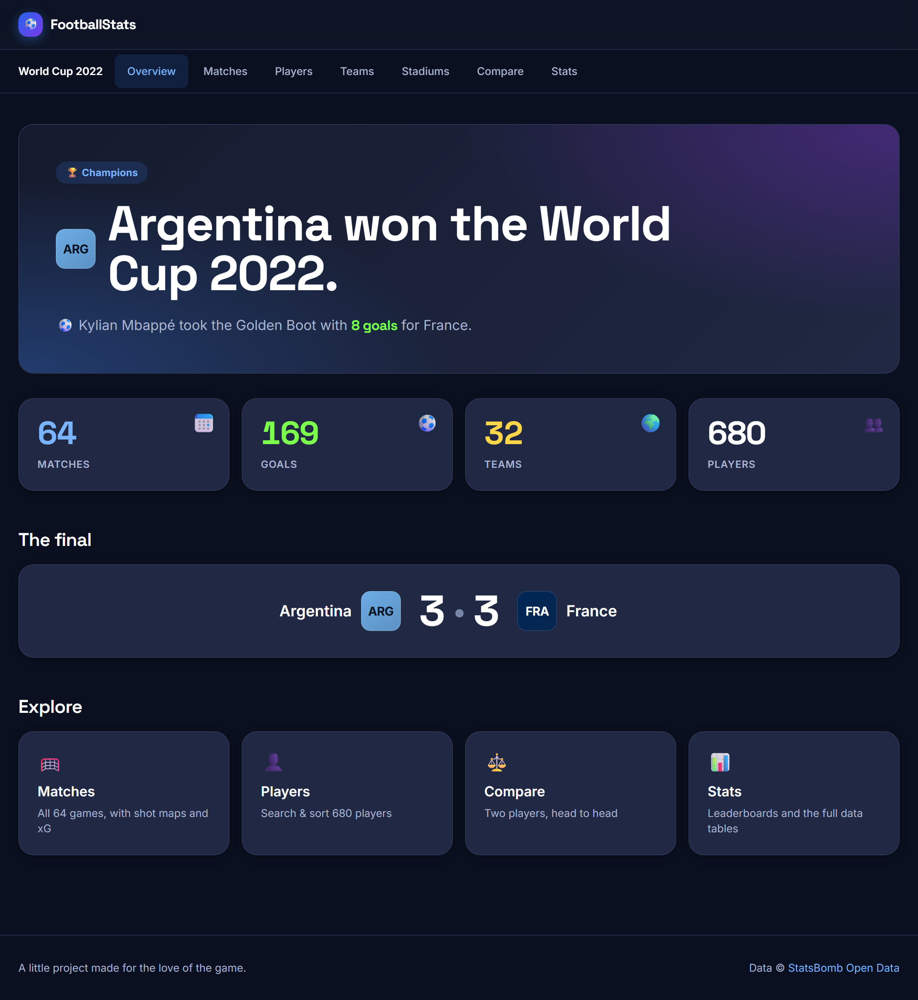
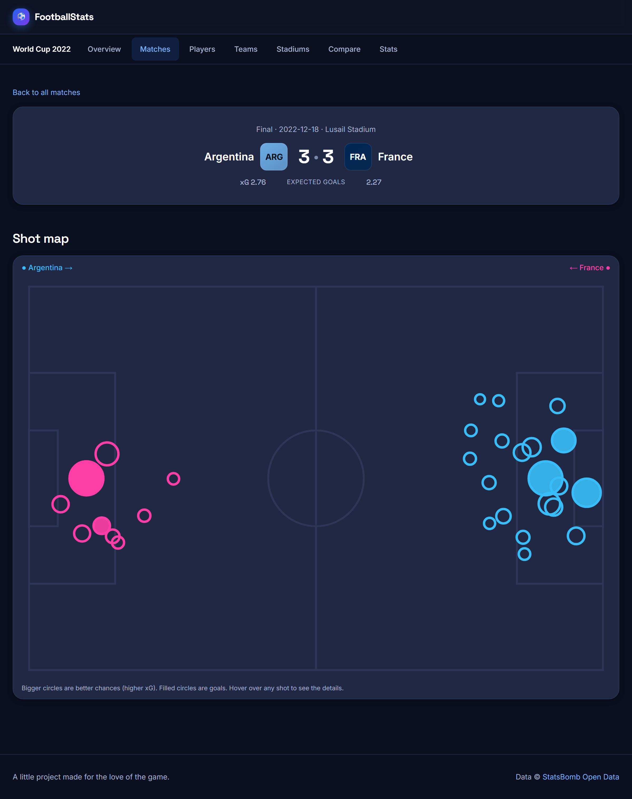
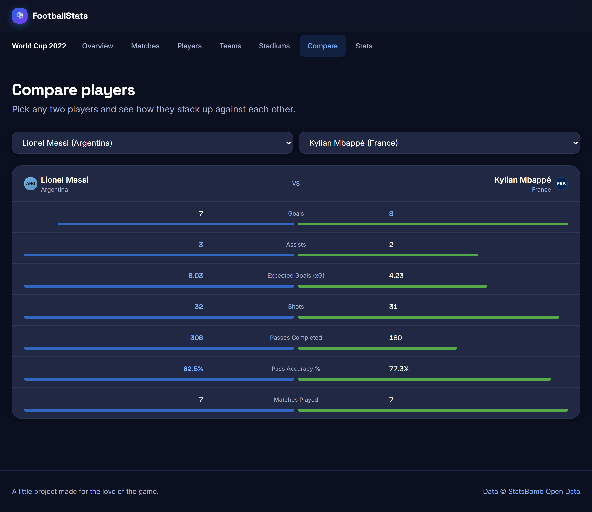
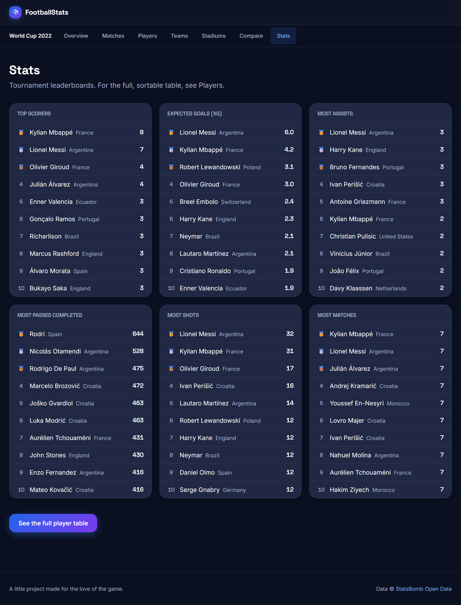
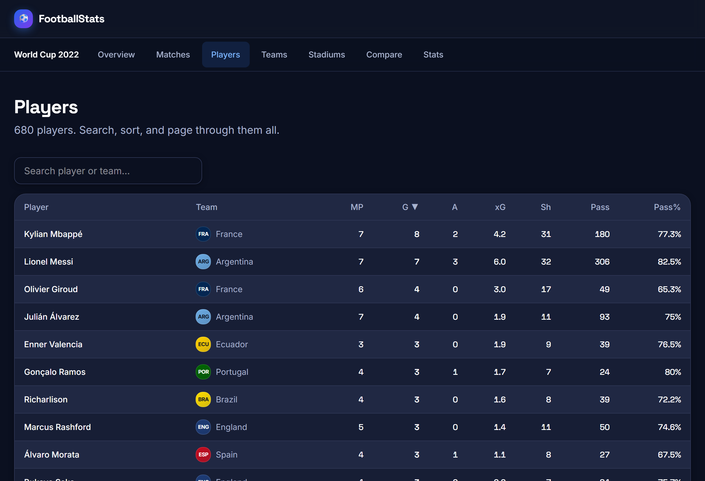

<h1 align="center">⚽ FootballStats</h1>

<p align="center">
  <b>A bold, visual home for football statistics.</b><br>
  Shot maps, expected goals, and the details that explain a match — not just list it.
</p>

<p align="center">
  
  
  
  
  
</p>

<p align="center">
  
</p>

---

## About this project

**FootballStats** is a portfolio project I built to see how close a solo developer can get to a
"premium" sports-stats experience — the kind of shot maps and expected-goals visuals that usually
sit behind paywalls — using only free, open data.

The guiding principle throughout is **insights first, statistics second**: every page tells the
story (who won, who scored, what the game looked like) before offering the deep tables. It currently
covers two complete tournaments — the **2022 World Cup** and **2024 Copa America** — and adding
another is a one-line config change.

> It's built on [StatsBomb Open Data](https://github.com/statsbomb/open-data), which publishes
> full event-level data (every pass, shot, and xG value) for select competitions, free for
> non-commercial use.

## What it does

- 🗺️ **Shot maps** — every shot from a match plotted on the pitch, sized by xG, colored by team.
- 📊 **Deep stats** — goals, assists, xG, passing, and finishing (goals vs. expected) for 1,000+ players.
- ⚖️ **Head-to-head compare** — pick any two players and see them side by side.
- 🏆 **Story-first overviews** — champion, Golden Boot, and the final, up top.
- 🔎 **Sortable, searchable, paginated** player tables.
- 🌗 **Bold dark theme** with Space Grotesk display type, responsive to mobile, **WCAG AA** contrast.

## Screenshots

| Match shot map | Head-to-head compare |
|---|---|
|  |  |

| Leaderboards | Player table |
|---|---|
|  |  |

## How it's built

Two clean halves — a Python data pipeline and a static Next.js site:

```
StatsBomb  →  pipeline/ (Python)  →  data/competitions/<slug>/*.json  →  web/ (Next.js SSG)
```

The site is **fully static**: all ~1,200 pages are pre-rendered at build time, so it loads instantly
and can be hosted for free.

- **Frontend** — Next.js 16 (App Router), TypeScript, Tailwind CSS v4, a small custom design system.
- **Data pipeline** — Python (`statsbombpy` + `pandas`) fetches raw event data and aggregates it into
  clean, per-competition JSON.
- **Visuals** — hand-built SVG shot maps (no charting library).

## Engineering decisions I'm happy with

- **A data-accuracy catch that matters.** StatsBomb records penalty-shootout kicks as goals — which
  inflated Messi to 9 World Cup goals. Excluding shootout periods makes the top-scorer list match the
  official Golden Boots (Mbappé 8, Messi 7). On a stats site, accuracy *is* the product.
- **Common names from the data, not a hardcoded list.** Player names use StatsBomb's `nickname` field
  (Lionel Messi, not "Lionel Andrés Messi Cuccittini"), falling back to the full name.
- **A single data seam.** Every read goes through one module (`web/src/lib/data.ts`), so the flat-JSON
  backend could be swapped for a database without touching a single page.
- **Multi-competition by config.** Data and routes are competition-scoped (`/[competition]/…`); a new
  tournament is a line in `pipeline/config.py`.
- **Accessibility as a real pass.** After a design critique, I split the green into a decorative shade
  and an accessible "text green," lifting links/buttons from 3.3:1 to 5.0:1 (WCAG AA).

## Project layout

```
pipeline/     Python: fetch + transform StatsBomb data
  fetch.py       download raw data per competition   → data/raw/<slug>/
  transform.py   aggregate into clean JSON           → data/competitions/<slug>/
  config.py      COMPETITIONS list, slugs, JSON helpers
data/
  competitions.json            index (+ champion, Golden Boot per competition)
  competitions/<slug>/         meta, matches, players, teams, stadiums, matches/<id>
web/          Next.js app
  src/lib/data.ts              the data seam — every read goes through here
  src/app/[competition]/       overview + matches/players/teams/stadiums/compare/stats
  src/components/              ShotMap, PlayerTable, CompareTool, TeamBadge, ...
```

## Run it locally

**1. Generate the data** (first run downloads the raw dumps; cached after that):

```bash
cd pipeline
pip install -r requirements.txt
python fetch.py        # → data/raw/<slug>/
python transform.py    # → data/competitions/<slug>/
```

**2. Run the site:**

```bash
cd web
npm install
npm run dev      # http://localhost:3000
npm run build    # production build — prerenders every page
```

## Notes & credits

- Goals/shots/xG exclude penalty-shootout kicks; own goals aren't attributed to a player (so goal
  totals sit a touch below the official count).
- Data © [StatsBomb Open Data](https://github.com/statsbomb/open-data), used under their free user
  agreement. **Non-commercial.**
