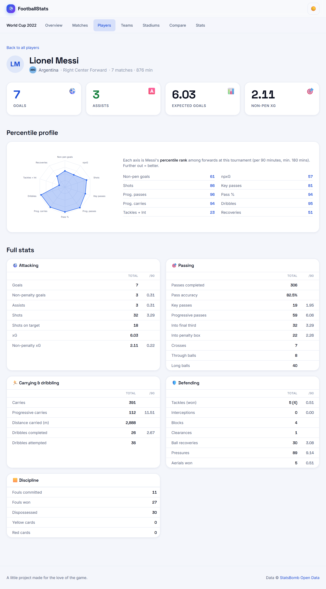
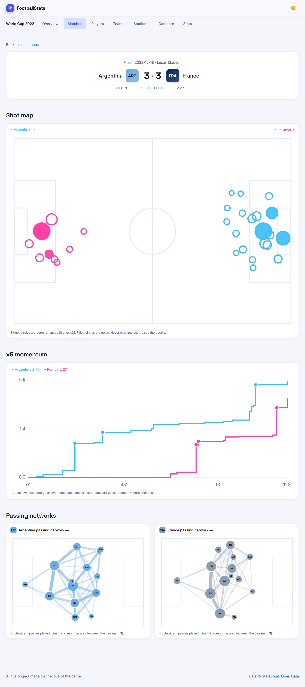
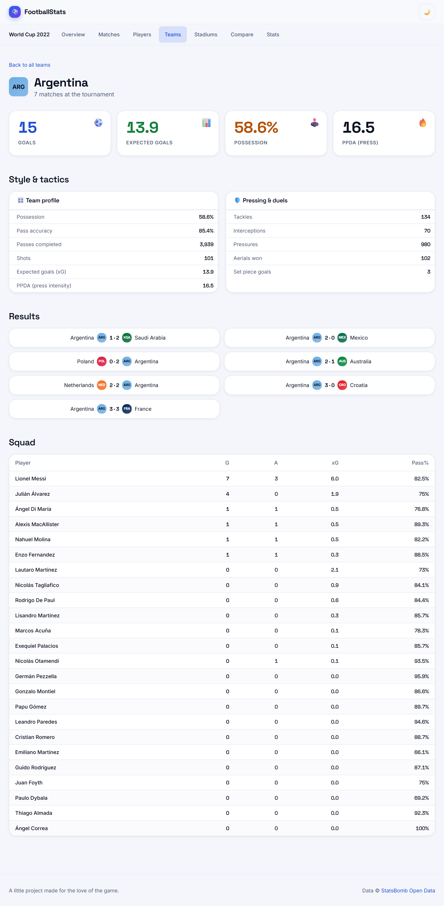

<h1 align="center">⚽ FootballStats</h1>

<p align="center">
  <b>A bold, visual home for football statistics.</b><br>
  Percentile scouting radars, shot maps, xG momentum, and passing networks. The kind of depth that usually sits behind a paywall.
</p>

<p align="center">
  
  
  
  
  
</p>

<p align="center">
  
</p>

---

## About this project

**FootballStats** is a portfolio project I built to see how close a solo developer can get to a
"premium" sports-analytics experience (the kind of scouting radars and expected-goals visuals that
usually sit behind a paywall) using only free, open data.

The guiding principle throughout is **insights first, statistics second**: every page tells the
story (who won, who scored, what the game looked like) before offering the deep tables. It currently
covers two complete tournaments, the **2022 World Cup** and **2024 Copa America**, and adding
another is a one-line config change.

> Built on [StatsBomb Open Data](https://github.com/statsbomb/open-data), which publishes full
> event-level data (every pass, shot, and xG value) for select competitions, free for
> non-commercial use.

## What it does

- 📈 **Percentile scouting radars.** Every qualified player is ranked against position peers across
  10 metrics (per 90 minutes), just like a professional scouting report.
- 🗺️ **Shot maps & xG momentum.** Every shot plotted on the pitch, plus a cumulative xG race chart
  that tells the story of a match minute by minute.
- 🕸️ **Passing networks.** Each team's structure on the pitch: players at their average position,
  linked by the passes they exchanged.
- 🧮 **Deep stat lines** for 1,000+ players across attacking, passing, carrying, defending,
  discipline and goalkeeping, each with per-90 rates.
- 🎛️ **Team tactical stats:** possession, pressing intensity (PPDA), set pieces, duels and more.
- ⚖️ **Head-to-head compare** and sortable, searchable, paginated tables.
- 🌗 **Light & dark themes** (Space Grotesk display type), responsive to mobile, **WCAG AA** contrast.

## Screenshots

| Percentile scouting report | Match: xG momentum & passing networks |
|---|---|
|  |  |

| Team tactical profile | Leaderboards |
|---|---|
|  |  |

## How it's built

Two clean halves: a Python data pipeline and a static Next.js site.

```
StatsBomb  →  pipeline/ (Python)  →  data/competitions/<slug>/*.json  →  web/ (Next.js SSG)
```

The site is **fully static**: all ~1,200 pages are pre-rendered at build time, so it loads instantly
and can be hosted for free.

- **Frontend:** Next.js 16 (App Router), TypeScript, Tailwind CSS v4, a small custom design system.
- **Data pipeline:** Python (`statsbombpy` + `pandas`) fetches raw event data; `metrics.py` turns
  234k+ events per tournament into deep per-player, per-team and per-match stats.
- **Visuals:** hand-built SVG throughout (shot maps, percentile radars, xG timelines, pass networks).
  No charting library.

## Engineering decisions I'm happy with

- **A data engine, not just aggregates.** `pipeline/metrics.py` computes minutes played (from lineup
  stints), per-90 rates, and **percentile ranks** vs. position peers, plus progressive passes/carries,
  pressing intensity (PPDA) and pass networks from the raw events.
- **Accuracy over convenience.** StatsBomb records penalty-shootout kicks as goals (which inflated
  Messi to 9 World Cup goals); excluding them matches the official Golden Boots. A first naive PPDA
  gave an impossible 2.4, so I switched to the canonical zone-based definition (roughly 8 to 16). On a stats
  site, accuracy *is* the product.
- **Common names from the data**, not a hardcoded list: StatsBomb's `nickname` field (Lionel Messi,
  not "Lionel Andrés Messi Cuccittini"), with a full-name fallback.
- **A single data seam.** Every read goes through one module (`web/src/lib/data.ts`), so the flat-JSON
  backend could be swapped for a database without touching a single page.
- **Multi-competition by config.** Data and routes are competition-scoped (`/[competition]/…`); a new
  tournament is a line in `pipeline/config.py`.
- **Accessibility as a real pass.** WCAG AA contrast in both light and dark themes, 44px touch
  targets, and visible focus rings, verified with measured contrast ratios.

## Project layout

```
pipeline/     Python: fetch + transform StatsBomb data
  fetch.py       download raw data per competition   -> data/raw/<slug>/
  transform.py   assemble clean JSON                 -> data/competitions/<slug>/
  metrics.py     deep stats: minutes, per-90, percentiles, tactics, pass networks
  config.py      COMPETITIONS list, slugs, JSON helpers
data/
  competitions.json            index (+ champion, Golden Boot per competition)
  competitions/<slug>/         meta, matches, players, teams, stadiums, matches/<id>
web/          Next.js app
  src/lib/data.ts              the data seam (every read goes through here)
  src/app/[competition]/       overview + matches/players/teams/stadiums/compare/stats
  src/components/              ShotMap, RadarChart, XGTimeline, PassNetwork,
                               StatBlock, CompareTool, TeamBadge, ThemeToggle, ...
```

## Run it locally

**1. Generate the data** (first run downloads the raw dumps; cached after that):

```bash
cd pipeline
pip install -r requirements.txt
python fetch.py        # → data/raw/<slug>/
python transform.py    # → data/competitions/<slug>/
```

**2. Run the site:**

```bash
cd web
npm install
npm run dev      # http://localhost:3000
npm run build    # production build, prerenders every page
```

## Notes & credits

- Goals/shots/xG exclude penalty-shootout kicks; own goals aren't attributed to a player (so goal
  totals sit a touch below the official count).
- Data © [StatsBomb Open Data](https://github.com/statsbomb/open-data), used under their free user
  agreement. **Non-commercial.**
